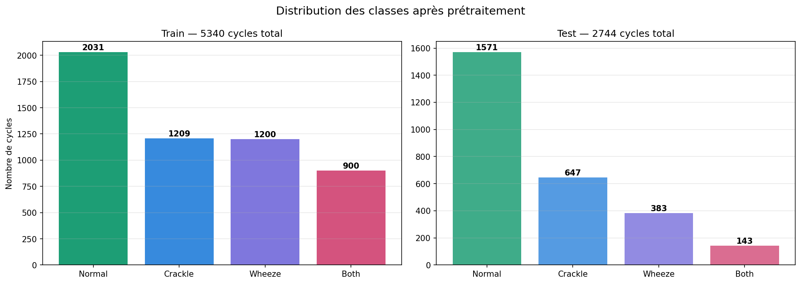
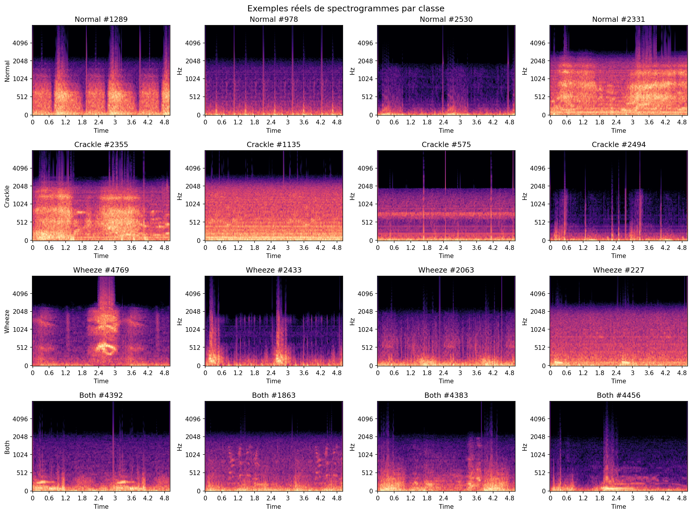
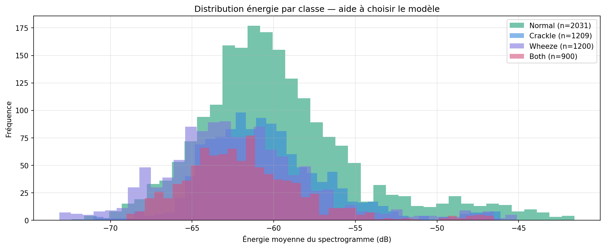
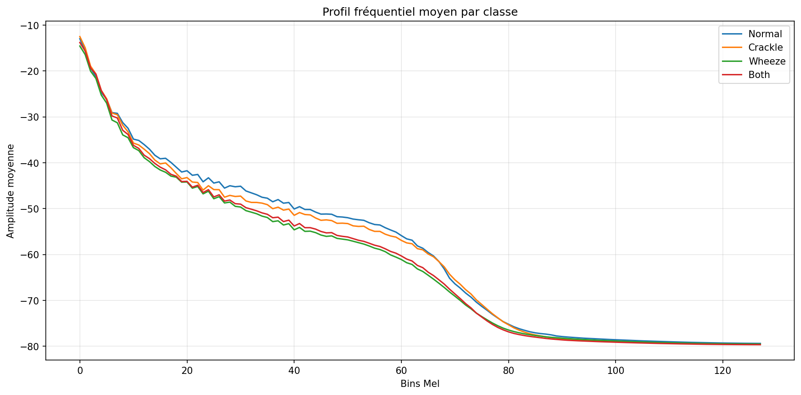

# icbhi-respiratory-sound-classification
#  Respiratory Sound Classification (ICBHI Challenge)

This project focuses on classifying respiratory sounds into four categories:
**Normal, Crackle, Wheeze, and Both** using deep learning.

A complete pipeline was developed, including preprocessing, visualization, modeling, and evaluation using domain-specific metrics.

---

## Objective

- Classify lung sounds from audio recordings
- Handle class imbalance
- Analyze model behavior using confusion matrices and per-class metrics

---

##  Dataset

- Source: **ICBHI Respiratory Sound Database**
- Total cycles: **6898**
- Classes:
  - Normal: 3642
  - Crackle: 1864
  - Wheeze: 886
  - Both: 506

### Class distribution



👉 The dataset is **highly imbalanced**, which strongly impacts model behavior.

---

##  Pipeline

### 1. Preprocessing

1. **Load raw respiratory cycle**
2. **Optional pitch shifting** (training only, for augmentation)
3. **Band-pass filtering** to reduce irrelevant frequencies
4. **Cyclic padding** to a fixed target length
5. **Z-score normalization**
6. **Conversion to log-Mel spectrogram**
7. **Encoding labels** into one-hot format
8. **Saving precomputed arrays** as compressed `.npz` files

### Training / Test flow
- **Train set**
  - short-cycle filtering
  - oversampling of rare classes
  - preprocessing + augmentation
- **Test set**
  - short-cycle filtering
  - preprocessing only

### Output
Preprocessed data are stored as:
- `train.npz`
- `test.npz`

Each file contains:
- `X`: spectrograms
- `Y`: one-hot labels
- `L`: integer labels

### 2. Data Analysis & Visualization

#### Spectrogram examples



Observations:
- Crackles → short spikes
- Wheezes → continuous frequency bands
- Both → combination of both patterns

---

#### Duration distribution



👉 Respiratory cycles vary significantly across classes.

---

#### Frequency profiles



Classes are **not easily separable globally**, requiring local feature learning.

---

## Models

### ✔ Multi-scale CNN
- Extracts local time-frequency patterns
- Uses multiple kernel sizes

### ✔ CNN + BiGRU (Final Model)
- CNN → spatial feature extraction
- BiGRU → temporal modeling
- Better suited for respiratory signals

---

## Training Strategy

- Loss: **CrossEntropyLoss with class weights**
- Optimizer: **AdamW**
- Class imbalance handled using:
  - Weighted loss
  - Weighted sampler

---

## Evaluation Metrics

- Sensitivity (Se)
- Specificity (Sp)
- ICBHI Score = (Se + Sp) / 2
- Accuracy
- Confusion Matrix
- Precision / Recall / F1 per class

---


## How to Run

```bash
pip install -r requirements.txt
python train.py
